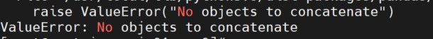

# Cryptosporidium Multilocus Genotyping


### Tool Functionality

This tool's intended purpose is to identify Cryptosporidium species based on the characterization of three genes - 18s, actin and hsp70. 

This tool has been converted into a Docker container for ease of use.

# Disclaimer

****Please note that the assays used are not ISO or CLIA-certified and should NOT be considered diagnostic!***

## Building Container
This repository consists of Cryptosporidium Genotyping characterization scripts, database and associated Docker file required to build a docker image.

To rebuild the container, clone this repository and run the command below:
`docker build -tag(optional) -file Dockerfile <location>`

- Scripts folder
- Curated blast database - db_all3
- Test input files - to ensure docker container runs as expected
- Docker file - if you would like to build container on your own
- Settings.txt - dependencies script support file

## Requirements:

- Linux Operating system 
- [Docker](https://docs.docker.com/) 
- Python 3.7

## Expected Input:

Illumina denovo assembly files in fasta format or Sanger assembly file. 

We suggest using the WDPB CDS PHL crypto_decon_db_tool to determine if your sequencing data set is optimal for genome assembly before using this tool. Also we tested this tool with the Skesa assembler.


## Expected Output: 

A csv format file with the following columns: XX,XXX,XXX 


### Running with Docker

First, create an output directory before running the container. This output directory will be mounted to the container to capture your results locally.
``` mkdir <your_output_directory>```

Next, pull down docker container

```
docker pull wdpbcdsphl/Cryptosporidium_Genotyping/cryptosporidium_genotyping:1.8
```
```
docker run -v $(pwd)/testinput:/Crypto/testinput/ -v $(pwd)/Crypto_output:/Crypto/resultsdir/ --privileged --rm wdpbcdsphl/cryptosporidium_genotyping:1.8
```

You can replace the testinput folder with your input folder

If you encounter any error while running the docker container, add --rm flag to the above command, this will clean up any running containers/file system that interrupts the current run. more info on --rm flag

```
docker run -v $(pwd)/testinput:/Crypto/testinput/ -v $(pwd)/Crypto_output:/Crypto/resultsdir/ --privileged **--rm** wdpbcdsphl/cryptosporidium_genotyping:1.8
```

**Note Make sure all your files are in the same directory from where you are running the image, if not change the paths to respective locations

Please replace the testinput with your input assemblies folder/

Bind the User_settings.txt file as is, it is just to mirror the paths that are present at root level in the docker container for singularity to exec and access the folders

If you want to access the intermediate files, add -B $(pwd)/some_dir:/Crypto/localdir/ to the singularity exec command.

### Running with Singularity
First, pull down the container
```
singularity pull docker://wdpbcdsphl/cryptosporidium_genotyping:1.8
```
Run container with Singularity:

```
singularity exec -B $(pwd)/User_settings.txt:/Crypto/scripts/settings.txt -B $(pwd)/testinput:/Crypto/testinput/ -B $(pwd)/Crypto_output:/Crypto/resultsdir/ **cryptosporidium_genotyping-1.8.simg** python3 /Crypto/scripts/Cryptosporidium_Genotyping_Revised.py
```
### Potential Tool Issues Addressed:

#### What do to if you input bad data or non-crypto assemblies into the tool?  


##### Bad data

Running the tool with bad assemblies or low quality assemblies will only result in wrong characterization
For example:
low_quality_samples/sample1_skesa.fasta.gz was converted to assemblies with out performing any upstream analysis (read trimming, QC etc)
Hence the genotyping of this sample was wrongly characterized.

| Genome | wrong species | actual species |
| ------ | ------------ | ---------------- |
| sample1_skesa.fasta.gz | C. hominis | C. deer mouse genotype III |

Note: It is always important to do the QC analysis and prepare your assemblies for the Cryptosporidium genotyping

Tools we used in-house for upstream analysis : FastQC, Trim Galore, Kraken2 [see how to run kraken here](https://github.com/CDCgov/WDPB_CDS_PHL_Tools/tree/master/Crypto_DeconDB_Tool), Skesa for assembly generation.

##### non-crypto

Rememeber the reference database is specifically curated for Cryptosporidium species, there will not be any data that can be aligned and filtered by the BLAST step in the tool if by mistake you input any non Cryptosporidium assemblies. It will throw an error like below



If you see this error image, that means you have wrong inputs for the tool. Make sure to correct the input assemblies.


## Developer
Developed by: Anusha Ginni, (qux0@cdc.gov) 
Clinical Detection Surveillance/WDPB, CDC
Tool version - 1.8
Database was updated on: 2021-XX-XX
